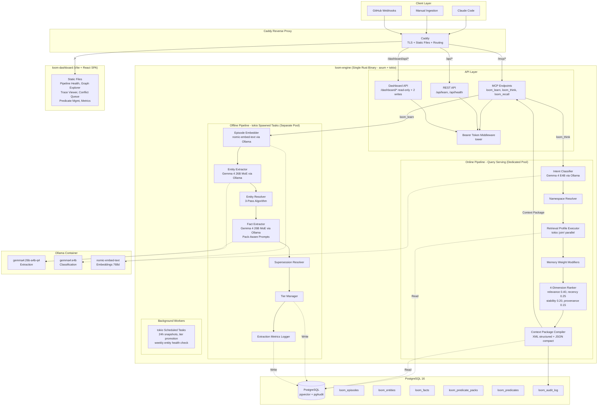

# Design Document: Project Loom Memory Compiler

## Overview

Project Loom is a PostgreSQL-native memory compiler that provides evidence-grounded memory for AI workflows. The system ingests interaction records (episodes) from multiple sources, extracts structured knowledge (entities and facts), and compiles relevant context packages for AI queries. The design emphasizes strict namespace isolation, temporal fact tracking with provenance, and inspectable retrieval decisions.

The system is implemented as a **single Rust binary** (loom-engine) using the **tokio async runtime** and **axum HTTP framework**, with local LLM inference via **Ollama** (Gemma 4 models) and **nomic-embed-text** embeddings (768 dimensions). An operational **React dashboard** (Vite build, served as static files by Caddy) provides pipeline health monitoring, compilation trace viewing, conflict review, predicate pack management, and retrieval quality metrics.

The system operates through two strictly separated pipelines:
- **Online pipeline**: Serves user queries with low latency by classifying intent, retrieving relevant memory, and compiling context packages. Uses a dedicated database connection pool.
- **Offline pipeline**: Processes episodes asynchronously via tokio spawned tasks to extract entities and facts without blocking queries. Uses a separate database connection pool.

Key design principles:
- PostgreSQL as single system of record (no external vector stores or graph databases)
- Single Rust binary with tokio for both serving and background processing (no separate worker container)
- Prefer fragmentation over collision in entity resolution (recoverable vs. corrupting)
- Extraction quality is foundational (everything downstream depends on it)
- Hard namespace isolation by default (cross-namespace features deferred)
- Comprehensive audit logging for every compilation decision
- Local-first LLM inference via Ollama with Azure OpenAI as fallback only
- Compile-time checked SQL queries via sqlx, strict JSON deserialization via serde

## Architecture

### System Components



### Deployment Architecture (Docker Compose — Five Containers)

The system deploys as five Docker containers orchestrated via Docker Compose:

1. **loom-engine** (Rust binary, ~20MB image)
   - Single static binary built via multi-stage Dockerfile (builder + scratch/distroless)
   - Serves MCP, REST, and Dashboard API endpoints on port 8080
   - Handles online pipeline (query serving) with dedicated connection pool
   - Runs offline pipeline via tokio spawned tasks with separate connection pool
   - Runs scheduled tasks (24h snapshots, tier promotion, weekly entity health check) via tokio
   - Connects to PostgreSQL and Ollama via internal Docker network

2. **loom-dashboard** (Vite + React SPA)
   - Static files built by Vite, served by Caddy
   - Views: pipeline health, compilation traces, graph explorer, conflict review, predicate management, metrics, extraction quality, benchmarks
   - Typed API client communicating with loom-engine dashboard endpoints

3. **postgres** (PostgreSQL 16)
   - pgvector and pgAudit extensions
   - Persistent volume for data storage
   - All loom_* tables with compile-time checked queries via sqlx
   - Exposed on port 5432 (internal network only)

4. **ollama** (Local LLM inference)
   - gemma4:26b-a4b-q4 for entity and fact extraction
   - gemma4:e4b for intent classification
   - nomic-embed-text for 768-dimension embeddings
   - Zero cloud dependency for inference

5. **caddy** (Reverse proxy + TLS + static file serving)
   - Routes /api/*, /mcp/*, /dashboard/api/* to loom-engine:8080
   - Serves dashboard static files for all other paths
   - Automatic TLS certificate management

### Pipeline Separation

The online and offline pipelines share the PostgreSQL database but use **separate connection pools** (sqlx::PgPool) to ensure offline processing never starves the serving path:

**Online Pipeline (Latency-Sensitive — Dedicated Pool)**
- Triggered by: `loom_think` MCP calls
- Reads from: All memory tables (episodes, entities, facts, procedures)
- Writes to: `loom_audit_log`, serving state tables (access counts, last_accessed)
- Target latency: < 500ms p95
- Never blocks on offline processing
- Retrieval profiles execute in parallel via `tokio::join!`

**Offline Pipeline (Throughput-Oriented — Separate Pool)**
- Triggered by: `loom_learn` MCP calls (tokio spawned tasks)
- Reads from: `loom_episodes`, `loom_entities`, `loom_predicates`, `loom_predicate_packs`
- Writes to: All memory tables, resolution conflicts, predicate candidates, extraction metrics
- Asynchronous: Returns immediately after episode storage
- Processing time: 1-3 seconds per episode
- Logs extraction metrics as JSONB on the episode record

### Rust Application Structure

```
loom-engine/
├── Cargo.toml
├── src/
│   ├── main.rs                 # tokio::main, axum router setup
│   ├── config.rs               # Configuration (env vars, model endpoints)
│   ├── db/
│   │   ├── mod.rs
│   │   ├── pool.rs             # sqlx::PgPool initialization (online + offline pools)
│   │   ├── episodes.rs         # Episode CRUD queries
│   │   ├── entities.rs         # Entity CRUD + resolution queries
│   │   ├── facts.rs            # Fact CRUD + supersession queries
│   │   ├── predicates.rs       # Predicate registry + pack queries
│   │   ├── procedures.rs       # Procedure queries
│   │   ├── audit.rs            # Audit log writes
│   │   ├── snapshots.rs        # Hot-tier snapshot queries
│   │   ├── traverse.rs         # Graph traversal (calls loom_traverse SQL function)
│   │   └── dashboard.rs        # Read-only dashboard data queries
│   ├── llm/
│   │   ├── mod.rs
│   │   ├── client.rs           # Ollama HTTP client (reqwest), Azure OpenAI fallback
│   │   ├── embeddings.rs       # nomic-embed-text embedding generation (768d)
│   │   ├── extraction.rs       # Entity + fact extraction prompt execution (Gemma 4 26B MoE)
│   │   └── classification.rs   # Intent classification (Gemma 4 E4B)
│   ├── pipeline/
│   │   ├── mod.rs
│   │   ├── offline/
│   │   │   ├── mod.rs
│   │   │   ├── ingest.rs       # Episode ingestion + dedup (sha2 content hash)
│   │   │   ├── extract.rs      # Entity + fact extraction orchestration
│   │   │   ├── resolve.rs      # Three-pass entity resolution
│   │   │   ├── supersede.rs    # Fact supersession detection
│   │   │   ├── state.rs        # Derived state computation + tier management
│   │   │   └── procedures.rs   # Candidate procedure flagging
│   │   └── online/
│   │       ├── mod.rs
│   │       ├── classify.rs     # Intent classification stage
│   │       ├── namespace.rs    # Namespace resolution
│   │       ├── retrieve.rs     # Retrieval profile execution (parallel via tokio::join!)
│   │       ├── weight.rs       # Memory weight modifiers
│   │       ├── rank.rs         # 4-dimension ranking + trimming
│   │       └── compile.rs      # Package compilation (XML structured + JSON compact)
│   ├── api/
│   │   ├── mod.rs
│   │   ├── mcp.rs              # MCP JSON-RPC endpoint (loom_think, loom_learn, loom_recall)
│   │   ├── rest.rs             # REST endpoint (/api/learn, /api/health)
│   │   ├── dashboard.rs        # Dashboard API endpoints (read-only + 2 writes)
│   │   └── auth.rs             # Bearer token middleware (tower)
│   ├── worker/
│   │   ├── mod.rs
│   │   ├── processor.rs        # Background episode processing loop (tokio spawned tasks)
│   │   └── scheduler.rs        # Periodic tasks (24h snapshots, tier promotion, weekly health check)
│   └── types/
│       ├── mod.rs
│       ├── episode.rs          # Episode structs + serde
│       ├── entity.rs           # Entity structs + resolution types
│       ├── fact.rs             # Fact structs + evidence types
│       ├── predicate.rs        # PredicateEntry, PredicatePack, pack query types
│       ├── classification.rs   # ClassificationResult, TaskClass enum
│       ├── compilation.rs      # CompiledPackage, OutputFormat
│       ├── audit.rs            # AuditLogEntry struct
│       └── mcp.rs              # MCP protocol types (JSON-RPC request/response)
├── migrations/
│   ├── 001_episodes.sql
│   ├── 002_entities.sql
│   ├── 003_predicate_packs.sql         # loom_predicate_packs table + core pack seed
│   ├── 004_predicates.sql              # loom_predicates with pack column + regulatory category
│   ├── 005_facts.sql
│   ├── 006_procedures.sql
│   ├── 007_resolution_conflicts.sql
│   ├── 008_namespace_config.sql        # includes predicate_packs TEXT[] column
│   ├── 009_audit_log.sql
│   ├── 010_snapshots.sql
│   ├── 011_traverse_function.sql
│   ├── 012_seed_core_predicates.sql    # 25 core predicates
│   └── 013_seed_grc_pack.sql           # GRC pack + 23 regulatory predicates
├── prompts/
│   ├── entity_extraction.txt   # Loaded at startup, not compiled
│   ├── fact_extraction.txt     # Pack-aware dynamic prompt template
│   └── classification.txt
└── Dockerfile                  # Multi-stage: builder + scratch/distroless
```


## Components and Interfaces

### MCP Interface

The system exposes three Model Context Protocol endpoints for AI assistant integration, served via axum on the loom-engine binary:

**loom_learn(content, source, namespace, occurred_at, metadata, participants)**
- Ingests a new episode into the system
- Returns: `{episode_id, status: "accepted" | "duplicate" | "queued"}`
- Asynchronous: Episode is stored immediately, extraction runs via tokio spawned task
- Idempotency: Duplicate detection via content hash (sha2 crate) and source_event_id unique constraint
- Serde deserialization validates all input fields at the type boundary

**loom_think(query, namespace, task_class_override, target_model)**
- Compiles a context package for an AI query
- Returns: `{context_package, token_count, compilation_id}`
- Synchronous: Blocks until context is compiled (uses online pipeline dedicated pool)
- Triggers full online pipeline execution
- Output format: XML-like structured tags for Claude models, JSON compact for local models

**loom_recall(entity_names, namespace, include_historical)**
- Direct fact lookup for specific entities
- Returns: `{facts: [{subject, predicate, object, evidence_status, provenance}]}`
- Synchronous: Simple database query via sqlx
- Bypasses intent classification and retrieval profiles

### LLM Client

The `llm/client.rs` module provides an HTTP client (reqwest) for Ollama with Azure OpenAI fallback:

**Ollama Integration (Primary)**
- Uses OpenAI-compatible API format (`/v1/chat/completions`, `/v1/embeddings`)
- Gemma 4 26B MoE (gemma4:26b-a4b-q4) for entity and fact extraction
- Gemma 4 E4B (gemma4:e4b) for intent classification
- nomic-embed-text for 768-dimension embeddings
- Model endpoints configured via environment variables

**Azure OpenAI Fallback**
- Same OpenAI-compatible API format
- gpt-4.1-mini for extraction when Ollama quality thresholds are not met
- Activated only when local model fails quality evaluation or Ollama is unavailable

### Intent Classifier

Classifies queries into one of five task classes to inform retrieval strategy. Uses Gemma 4 E4B via Ollama.

**Task Classes**
- `debug`: Troubleshooting issues, investigating errors
- `architecture`: Understanding system design, component relationships
- `compliance`: Audit trails, policy verification, evidence gathering
- `writing`: Documentation, code generation, content creation
- `chat`: General conversation, unclear intent

**Classification Algorithm**
1. Keyword matching for high-confidence signals
2. LLM call (Gemma 4 E4B via Ollama) for ambiguous cases
3. Compute primary and secondary class with confidence scores
4. If confidence gap < 0.3, use both classes for retrieval
5. If ambiguous with no clear signal, default to `chat`

**Output (Rust struct with serde)**
```rust
#[derive(Debug, Serialize, Deserialize)]
pub struct ClassificationResult {
    pub primary_class: TaskClass,
    pub secondary_class: Option<TaskClass>,
    pub primary_confidence: f64,
    pub secondary_confidence: Option<f64>,
}

#[derive(Debug, Serialize, Deserialize, Clone, Copy, PartialEq)]
#[serde(rename_all = "lowercase")]
pub enum TaskClass {
    Debug,
    Architecture,
    Compliance,
    Writing,
    Chat,
}
```

### Retrieval Profile Executor

Maps task classes to retrieval strategies and executes them in parallel via `tokio::join!`:

**Profile Mapping**
```rust
fn profiles_for_class(class: TaskClass) -> Vec<RetrievalProfile> {
    match class {
        TaskClass::Debug        => vec![GraphNeighborhood, EpisodeRecall],
        TaskClass::Architecture => vec![FactLookup, GraphNeighborhood],
        TaskClass::Compliance   => vec![EpisodeRecall, FactLookup],
        TaskClass::Writing      => vec![FactLookup],
        TaskClass::Chat         => vec![FactLookup],
    }
}
```

When a secondary task class is present, profiles from both classes are merged and deduplicated, capped at 3.

**Retrieval Profiles**

1. **fact_lookup**: Semantic facts matching query
   - Filters: `valid_until IS NULL`, `deleted_at IS NULL`, namespace match
   - Ranking: Vector similarity on source episodes + entity name matching
   - Returns: Up to 20 fact candidates

2. **episode_recall**: Recent episodes by relevance
   - Filters: `deleted_at IS NULL`, namespace match
   - Ranking: Vector similarity + recency weighting on occurred_at
   - Returns: Up to 10 episode candidates

3. **graph_neighborhood**: Related entities via traversal
   - Identifies entities mentioned in query
   - 1-hop traversal (2-hop if < 3 results)
   - Cycle prevention via path tracking (loom_traverse SQL function)
   - Returns: Entities and connecting facts

4. **procedure_assist**: High-confidence behavioral patterns
   - Filters: `evidence_status = 'promoted'`, `confidence >= 0.8`, `observation_count >= 3`
   - Excluded for compliance task class
   - Returns: Up to 3 procedure candidates

All profiles execute in parallel via `tokio::join!`. Results are merged and deduplicated by ID before ranking.

### Entity Extractor

Extracts structured entities from episode text using Gemma 4 26B MoE via Ollama. LLM responses are deserialized into strict Rust types via serde, rejecting malformed responses at the type boundary.

**Entity Types (Exactly 10)**
- person, organization, project, service, technology
- pattern, environment, document, metric, decision

**Extraction Rules**
- Use most specific common name (e.g., "APIM" not "Azure API Management")
- Avoid generic concepts (e.g., "authentication" is not an entity)
- Extract alias names when present
- Return JSON only, no preamble

**Output Format (serde deserialized)**
```rust
#[derive(Debug, Deserialize)]
pub struct ExtractionResponse {
    pub entities: Vec<ExtractedEntity>,
}

#[derive(Debug, Deserialize)]
pub struct ExtractedEntity {
    pub name: String,
    #[serde(deserialize_with = "validate_entity_type")]
    pub entity_type: EntityType,
    #[serde(default)]
    pub aliases: Vec<String>,
}
```

### Entity Resolver

Three-pass resolution algorithm to match extracted entities with existing entities. All queries are compile-time checked via sqlx.

**Pass 1: Exact Match**
- Match on: `(LOWER(name), entity_type, namespace)` via sqlx query
- Confidence: 1.0
- Action: Merge with existing entity

**Pass 2: Alias Match**
- Check if extracted name appears in existing entity's aliases array (JSONB GIN index)
- Check if extracted aliases match existing entity's name
- Both directions checked
- If exactly one match: Merge with confidence 0.95, append new name to aliases
- If multiple matches: Fall through to Pass 3

**Pass 3: Semantic Similarity**
- Embed entity name + context snippet via nomic-embed-text (768 dimensions)
- Query `loom_entity_state` by cosine similarity (pgvector) WHERE `entity_type` and `namespace` match
- Threshold: 0.92 (deliberately high)
- If top candidate > 0.92 AND gap to second >= 0.03: Merge with confidence = similarity
- If top two within 0.03: Create new entity, log conflict to `loom_resolution_conflicts`
- If no candidate > 0.92: Create new entity with confidence 1.0

**Design Principle**: Prefer fragmentation over collision. Two separate nodes can be merged later; incorrect merges corrupt all attached facts.

### Fact Extractor (Pack-Aware)

Extracts subject-predicate-object triples from episodes using Gemma 4 26B MoE via Ollama. The extraction prompt is **dynamically assembled** based on the namespace's configured predicate packs.

**Pack-Aware Prompt Assembly**
1. Load the namespace's configured predicate packs from `loom_namespace_config.predicate_packs`
2. Always include the `core` pack regardless of namespace configuration
3. Query `loom_predicates` for all predicates in the active packs
4. Format predicates into a grouped prompt block organized by pack name
5. Inject the grouped predicate block into the fact extraction prompt template

**Extraction Rules**
- Subject and object must reference extracted entities
- Predicates must use canonical registry when possible
- Flag custom predicates for tracking in `loom_predicate_candidates`
- Include temporal markers (valid_from, valid_until) when present
- Classify evidence strength (explicit vs. implied)

**Output Format (serde deserialized)**
```rust
#[derive(Debug, Deserialize)]
pub struct FactExtractionResponse {
    pub facts: Vec<ExtractedFact>,
}

#[derive(Debug, Deserialize)]
pub struct ExtractedFact {
    pub subject: String,
    pub predicate: String,
    pub object: String,
    pub evidence_strength: EvidenceStrength,
    #[serde(default)]
    pub temporal: Option<TemporalMarkers>,
    pub custom: bool,
}
```

### Supersession Resolver

Manages temporal fact validity and supersession:

**Supersession Logic**
- When new fact contradicts existing fact (same subject + predicate, different object)
- Set `valid_until = now()` on old fact
- Set `superseded_by = new_fact_id` on old fact
- Old fact remains in database (soft supersession, not deletion)

**Current Fact Filtering**
- Default queries filter to `valid_until IS NULL`
- Historical queries can include superseded facts
- Superseded facts cannot be promoted to hot tier

### Memory Weight Modifiers

Applies task-specific weights to candidate relevance scores:

```rust
fn memory_weights(class: TaskClass) -> (f64, f64, f64) {
    //                    (episodic, semantic, procedural)
    match class {
        TaskClass::Debug        => (1.0, 0.7, 0.8),
        TaskClass::Architecture => (0.5, 1.0, 0.3),
        TaskClass::Compliance   => (1.0, 0.8, 0.0), // procedural hard-excluded
        TaskClass::Writing      => (0.3, 1.0, 0.6),
        TaskClass::Chat         => (0.4, 1.0, 0.3),
    }
}
```

Weight of 0.0 means hard exclusion. All other weights multiply against relevance score before ranking.

### Four-Dimension Ranker

Scores candidates on four interpretable dimensions with explicit weights:

| Dimension | Weight | Basis |
|-----------|--------|-------|
| **Relevance** | 0.40 | Vector similarity to query, entity name matching, modified by memory weight |
| **Recency** | 0.25 | Time-based decay from occurred_at or valid_from timestamps |
| **Stability** | 0.20 | Current status (non-superseded), evidence_status authority, salience score |
| **Provenance** | 0.15 | Source episode count, evidence_status authority (user_asserted > observed > extracted > inferred) |

Each dimension scored 0.0-1.0. Final score = (relevance × 0.40) + (recency × 0.25) + (stability × 0.20) + (provenance × 0.15). Candidates sorted by final score descending.

### Context Package Compiler

Assembles ranked candidates into structured context packages:

**Compilation Steps**
1. Inject all hot tier memory for namespace (always included)
2. Add warm tier candidates up to token budget
3. Format by output format (structured or compact)
4. Include provenance information for each item
5. Compute total token count

**Output Formats**

*Structured Format* (XML-like tags for Claude, Claude Code):
```xml
<loom model="claude-3.5-sonnet" tokens="1847" namespace="project-sentinel" task="architecture">
  <identity>Project Sentinel memory context</identity>
  <project>Sentinel - AI-powered security monitoring</project>
  <knowledge>
    <fact subject="Project Sentinel" predicate="uses" object="Semantic Kernel"
          evidence="explicit" observed="2025-09-01" source="episode_def456"/>
    <fact subject="APIM" predicate="deployed_to" object="Azure Production"
          evidence="explicit" observed="2025-08-15" source="episode_ghi789"/>
  </knowledge>
  <episodes>
    <episode date="2025-01-15" source="claude-code" id="episode_abc123">
      Discussed APIM authentication flow changes...
    </episode>
  </episodes>
  <patterns>
    <pattern confidence="0.85" observations="5">
      When debugging auth issues, check APIM logs first
    </pattern>
  </patterns>
</loom>
```

*Compact Format* (JSON for local models, GPT):
```json
{
  "ns": "project-sentinel",
  "task": "architecture",
  "identity": "Project Sentinel memory context",
  "facts": [
    {"s": "Project Sentinel", "p": "uses", "o": "Semantic Kernel", "e": "explicit", "t": "2025-09-01"}
  ],
  "recent": [
    {"date": "2025-01-15", "src": "claude-code", "text": "Discussed APIM authentication..."}
  ],
  "patterns": [
    {"p": "When debugging auth issues, check APIM logs first", "c": 0.85, "n": 5}
  ]
}
```

### Tier Manager

Manages hot and warm tier promotion/demotion:

**Hot Tier Promotion Rules**
- Explicit user pin
- Retrieved and used in 5+ compilations within 14 days

**Hot Tier Demotion Rules**
- User unpins
- Not retrieved in 30 days
- Fact is superseded

**Hot Tier Constraints**
- Capped at namespace token budget (default 500 tokens)
- Overflow forces demotion of lowest-salience item
- Procedures require: 3+ episodes, 7+ days, confidence >= 0.8

**Warm Tier Archival**
- Superseded facts archived immediately
- Facts not accessed in 90 days archived
- Archived facts remain searchable but excluded from auto-retrieval

### Dashboard

The operational dashboard is a Vite + React SPA served as static files by Caddy. It communicates with the loom-engine via typed API client hitting `/dashboard/api/*` endpoints.

**Dashboard Views**

1. **Pipeline Health**: Episode counts by source/namespace, entity counts by type, current vs superseded fact counts, queue depth, model configuration
2. **Compilation Trace Viewer**: Paginated list of loom_think calls with timestamp, query, namespace, classification, confidence, latency, token count. Drill-down showing candidates found/selected/rejected with per-candidate score breakdown across relevance, recency, stability, provenance
3. **Knowledge Graph Explorer**: Entity search, entity detail with properties and aliases, visual graph rendering of 1-2 hop neighborhoods, fact detail with temporal range and supersession chain
4. **Entity Conflict Review Queue**: Unresolved conflicts with candidate matches and scores. Actions: merge, keep separate, split
5. **Predicate Candidate Review**: Unmapped custom predicates with occurrence counts, example facts. Actions: map to existing canonical predicate, promote to canonical with target pack selection
6. **Predicate Pack Browser**: All packs with predicate counts, drill-down to pack predicates with categories and usage counts, per-namespace active packs, usage heatmap
7. **Retrieval Quality Metrics**: Precision over time, latency percentiles (p50, p95, p99), classification confidence distribution, hot-tier utilization per namespace
8. **Extraction Quality View**: Model comparison (Gemma 4 vs gpt-4.1-mini), entity resolution method distribution, custom predicate growth rate, entity fragmentation detection
9. **Benchmark Comparison**: Side-by-side A/B/C condition results

**Dashboard API Endpoints** (on loom-engine)
- All GET endpoints are read-only
- Only 2 POST endpoints: conflict resolution and predicate candidate resolution (with optional target_pack for pack-aware promotion)
- Namespace listing endpoint for dashboard navigation


## Data Models

### Database Schema

The schema separates canonical data (immutable truth) from derived serving state (computed, recomputable, disposable). All queries are compile-time checked via sqlx against this schema. All vector columns use **vector(768)** for nomic-embed-text embeddings.

**Core Tables**

```sql
-- Episodes: Immutable evidence layer
CREATE TABLE loom_episodes (
  -- CANONICAL
  id              UUID PRIMARY KEY DEFAULT gen_random_uuid(),
  source          TEXT NOT NULL,                    -- claude-code, manual, github
  source_id       TEXT,
  source_event_id TEXT,
  content         TEXT NOT NULL,
  content_hash    TEXT NOT NULL,                    -- SHA-256 via sha2 crate
  occurred_at     TIMESTAMPTZ NOT NULL,
  ingested_at     TIMESTAMPTZ NOT NULL DEFAULT now(),
  namespace       TEXT NOT NULL,
  metadata        JSONB DEFAULT '{}',
  participants    TEXT[],
  -- EXTRACTION LINEAGE
  extraction_model TEXT,                            -- e.g. "gemma4:26b-a4b-q4", "gpt-4.1-mini"
  classification_model TEXT,                        -- e.g. "gemma4:e4b"
  extraction_metrics JSONB,                         -- ExtractionMetrics struct serialized per ingestion
  -- DERIVED (recomputable)
  embedding       vector(768),                      -- nomic-embed-text via Ollama
  tags            TEXT[],
  processed       BOOLEAN DEFAULT false,
  -- DELETION SEMANTICS
  deleted_at      TIMESTAMPTZ,
  deletion_reason TEXT,

  UNIQUE(source, source_event_id)
);

-- Entities: Graph nodes
CREATE TABLE loom_entities (
  -- CANONICAL
  id              UUID PRIMARY KEY DEFAULT gen_random_uuid(),
  name            TEXT NOT NULL,
  entity_type     TEXT NOT NULL CHECK (entity_type IN (
    'person', 'organization', 'project', 'service', 'technology',
    'pattern', 'environment', 'document', 'metric', 'decision'
  )),
  namespace       TEXT NOT NULL,
  properties      JSONB DEFAULT '{}',               -- includes aliases array
  created_at      TIMESTAMPTZ DEFAULT now(),
  source_episodes UUID[],                           -- provenance
  deleted_at      TIMESTAMPTZ,

  UNIQUE(name, entity_type, namespace)
);

-- Entity serving state: Derived, recomputable
CREATE TABLE loom_entity_state (
  entity_id       UUID PRIMARY KEY REFERENCES loom_entities(id),
  embedding       vector(768),                      -- nomic-embed-text via Ollama
  summary         TEXT,
  tier            TEXT DEFAULT 'warm' CHECK (tier IN ('hot', 'warm')),
  salience_score  FLOAT DEFAULT 0.5,
  access_count    INT DEFAULT 0,
  last_accessed   TIMESTAMPTZ,
  pinned          BOOLEAN DEFAULT false,
  updated_at      TIMESTAMPTZ DEFAULT now()
);

-- Predicate packs: Domain vocabulary sets
CREATE TABLE loom_predicate_packs (
  pack            TEXT PRIMARY KEY,                 -- 'core', 'grc', 'healthcare', 'finserv'
  description     TEXT,
  created_at      TIMESTAMPTZ DEFAULT now()
);

-- Canonical predicate registry (with pack and regulatory category)
CREATE TABLE loom_predicates (
  predicate       TEXT PRIMARY KEY,
  category        TEXT NOT NULL CHECK (category IN (
    'structural', 'temporal', 'decisional', 'operational',
    'regulatory'
  )),
  pack            TEXT NOT NULL DEFAULT 'core'
                  REFERENCES loom_predicate_packs(pack),
  inverse         TEXT,
  description     TEXT,
  usage_count     INT DEFAULT 0,
  created_at      TIMESTAMPTZ DEFAULT now()
);

-- Predicate candidates: Custom predicates awaiting review (with pack-aware promotion)
CREATE TABLE loom_predicate_candidates (
  id              UUID PRIMARY KEY DEFAULT gen_random_uuid(),
  predicate       TEXT NOT NULL,
  occurrences     INT DEFAULT 1,
  example_facts   UUID[],
  mapped_to       TEXT REFERENCES loom_predicates(predicate),
  promoted_to_pack TEXT REFERENCES loom_predicate_packs(pack),  -- target pack when promoted
  created_at      TIMESTAMPTZ DEFAULT now(),
  resolved_at     TIMESTAMPTZ
);

-- Facts: Temporal graph edges
CREATE TABLE loom_facts (
  -- CANONICAL
  id              UUID PRIMARY KEY DEFAULT gen_random_uuid(),
  subject_id      UUID NOT NULL REFERENCES loom_entities(id),
  predicate       TEXT NOT NULL,
  object_id       UUID NOT NULL REFERENCES loom_entities(id),
  namespace       TEXT NOT NULL,
  -- TEMPORAL
  valid_from      TIMESTAMPTZ NOT NULL DEFAULT now(),
  valid_until     TIMESTAMPTZ,                     -- NULL = currently valid
  -- PROVENANCE
  source_episodes UUID[] NOT NULL,
  superseded_by   UUID REFERENCES loom_facts(id),
  -- EVIDENCE STATUS
  evidence_status TEXT NOT NULL DEFAULT 'extracted' CHECK (evidence_status IN (
    'user_asserted', 'observed', 'extracted', 'inferred',
    'promoted', 'deprecated', 'superseded'
  )),
  evidence_strength TEXT CHECK (evidence_strength IN ('explicit', 'implied')),
  properties      JSONB DEFAULT '{}',
  created_at      TIMESTAMPTZ DEFAULT now(),
  deleted_at      TIMESTAMPTZ
);

-- Fact serving state: Derived, recomputable
CREATE TABLE loom_fact_state (
  fact_id         UUID PRIMARY KEY REFERENCES loom_facts(id),
  embedding       vector(768),
  salience_score  FLOAT DEFAULT 0.5,
  access_count    INT DEFAULT 0,
  last_accessed   TIMESTAMPTZ,
  tier            TEXT DEFAULT 'warm' CHECK (tier IN ('hot', 'warm')),
  pinned          BOOLEAN DEFAULT false,
  updated_at      TIMESTAMPTZ DEFAULT now()
);

-- Procedures: Candidate behavioral patterns
CREATE TABLE loom_procedures (
  id              UUID PRIMARY KEY DEFAULT gen_random_uuid(),
  pattern         TEXT NOT NULL,
  category        TEXT,
  namespace       TEXT NOT NULL,
  source_episodes UUID[] NOT NULL,
  first_observed  TIMESTAMPTZ DEFAULT now(),
  last_observed   TIMESTAMPTZ DEFAULT now(),
  observation_count INT DEFAULT 1,
  evidence_status TEXT NOT NULL DEFAULT 'extracted'
    CHECK (evidence_status IN ('extracted', 'promoted', 'deprecated')),
  confidence      FLOAT DEFAULT 0.3,
  embedding       vector(768),                     -- nomic-embed-text via Ollama
  tier            TEXT DEFAULT 'warm' CHECK (tier IN ('hot', 'warm')),
  deleted_at      TIMESTAMPTZ
);

-- Entity resolution conflict tracking
CREATE TABLE loom_resolution_conflicts (
  id              UUID PRIMARY KEY DEFAULT gen_random_uuid(),
  entity_name     TEXT NOT NULL,
  entity_type     TEXT NOT NULL,
  namespace       TEXT NOT NULL,
  candidates      JSONB NOT NULL,                  -- [{id, name, score, method}]
  resolved        BOOLEAN DEFAULT false,
  resolution      TEXT,                            -- "merged:id" or "kept_separate" or "split:id1,id2"
  resolved_at     TIMESTAMPTZ,
  created_at      TIMESTAMPTZ DEFAULT now()
);

-- Namespace configuration (with predicate pack assignment)
CREATE TABLE loom_namespace_config (
  namespace         TEXT PRIMARY KEY,
  hot_tier_budget   INT DEFAULT 500,               -- tokens
  warm_tier_budget  INT DEFAULT 3000,              -- tokens
  predicate_packs   TEXT[] DEFAULT '{core}',       -- which predicate packs this namespace uses
  description       TEXT,
  created_at        TIMESTAMPTZ DEFAULT now(),
  updated_at        TIMESTAMPTZ DEFAULT now()
);

-- Comprehensive audit log
CREATE TABLE loom_audit_log (
  id                UUID PRIMARY KEY DEFAULT gen_random_uuid(),
  created_at        TIMESTAMPTZ DEFAULT now(),
  task_class        TEXT NOT NULL,
  namespace         TEXT NOT NULL,
  query_text        TEXT,
  target_model      TEXT,
  primary_class     TEXT NOT NULL,
  secondary_class   TEXT,
  primary_confidence FLOAT,
  secondary_confidence FLOAT,
  profiles_executed TEXT[],
  retrieval_profile TEXT NOT NULL,
  candidates_found  INT,
  candidates_selected INT,
  candidates_rejected INT,
  selected_items    JSONB,                         -- [{type, id, memory_type, score_breakdown}]
  rejected_items    JSONB,                         -- [{type, id, memory_type, reason}]
  compiled_tokens   INT,
  output_format     TEXT,
  latency_total_ms  INT,
  latency_classify_ms INT,
  latency_retrieve_ms INT,
  latency_rank_ms   INT,
  latency_compile_ms INT,
  user_rating       FLOAT
);

-- Hot tier snapshots for audit trail
CREATE TABLE loom_snapshots (
  id              UUID PRIMARY KEY DEFAULT gen_random_uuid(),
  snapshot_at     TIMESTAMPTZ DEFAULT now(),
  namespace       TEXT NOT NULL,
  hot_entities    JSONB,
  hot_facts       JSONB,
  hot_procedures  JSONB,
  total_tokens    INT
);
```

**Seed Data**

The core predicate pack ships with 25 predicates across structural, temporal, decisional, and operational categories. The GRC predicate pack ships with 23 regulatory predicates. Both are seeded via migrations (012_seed_core_predicates.sql and 013_seed_grc_pack.sql). The GRC pack is seeded but not auto-assigned to any namespace — operators must explicitly add it.

**Key Indexes**

```sql
-- Episode retrieval
CREATE INDEX idx_episodes_embedding ON loom_episodes
  USING ivfflat (embedding vector_cosine_ops) WHERE deleted_at IS NULL;
CREATE INDEX idx_episodes_ns_occurred ON loom_episodes (namespace, occurred_at DESC)
  WHERE deleted_at IS NULL;
CREATE INDEX idx_episodes_hash ON loom_episodes (content_hash);
CREATE INDEX idx_episodes_unprocessed ON loom_episodes (ingested_at)
  WHERE processed = false AND deleted_at IS NULL;

-- Entity resolution
CREATE INDEX idx_entities_ns_type ON loom_entities (namespace, entity_type)
  WHERE deleted_at IS NULL;
CREATE INDEX idx_entities_aliases ON loom_entities
  USING gin ((properties->'aliases')) WHERE deleted_at IS NULL;

-- Fact retrieval
CREATE INDEX idx_facts_current ON loom_facts (namespace, subject_id)
  WHERE valid_until IS NULL AND deleted_at IS NULL;
CREATE INDEX idx_facts_object ON loom_facts (object_id)
  WHERE valid_until IS NULL AND deleted_at IS NULL;
CREATE INDEX idx_facts_status ON loom_facts (evidence_status);
CREATE INDEX idx_facts_predicate ON loom_facts (predicate)
  WHERE valid_until IS NULL AND deleted_at IS NULL;

-- Predicate pack lookup
CREATE INDEX idx_predicates_pack ON loom_predicates (pack);
```

**Graph Traversal Function**

```sql
CREATE OR REPLACE FUNCTION loom_traverse(
  p_entity_id UUID,
  p_max_hops INT DEFAULT 2,
  p_namespace TEXT DEFAULT 'default'
) RETURNS TABLE (
  entity_id UUID, entity_name TEXT, entity_type TEXT,
  fact_id UUID, predicate TEXT, evidence_status TEXT,
  hop_depth INT, path UUID[]
) AS $$
WITH RECURSIVE walk AS (
  -- Start node
  SELECT e.id, e.name, e.entity_type,
         NULL::UUID, NULL::TEXT, NULL::TEXT,
         0, ARRAY[e.id]
  FROM loom_entities e
  WHERE e.id = p_entity_id
    AND e.namespace = p_namespace
    AND e.deleted_at IS NULL

  UNION ALL

  -- Traverse edges
  SELECT e2.id, e2.name, e2.entity_type,
         f.id, f.predicate, f.evidence_status,
         w.hop_depth + 1, w.path || e2.id
  FROM walk w
  JOIN loom_facts f ON (f.subject_id = w.entity_id OR f.object_id = w.entity_id)
  JOIN loom_entities e2 ON (
    CASE WHEN f.subject_id = w.entity_id THEN f.object_id ELSE f.subject_id END = e2.id
  )
  WHERE w.hop_depth < p_max_hops
    AND f.valid_until IS NULL
    AND f.deleted_at IS NULL
    AND f.namespace = p_namespace
    AND e2.deleted_at IS NULL
    AND NOT e2.id = ANY(w.path)  -- Cycle prevention
)
SELECT * FROM walk WHERE hop_depth > 0
ORDER BY hop_depth, entity_name;
$$ LANGUAGE sql STABLE;
```

### Data Flow

**Episode Ingestion Flow**
1. Client calls `loom_learn(content, source, namespace, occurred_at)`
2. axum handler validates input via serde deserialization
3. Compute content_hash via sha2 crate
4. Check idempotency: Query `(source, source_event_id)` and `content_hash` via sqlx
5. If duplicate: Return existing episode_id with status "duplicate"
6. If new: Insert into `loom_episodes` via sqlx, return episode_id with status "queued"
7. Spawn tokio task for offline processing (separate connection pool)
8. Generate embedding via nomic-embed-text through Ollama
9. Extract entities via Gemma 4 26B MoE through Ollama
10. Resolve each entity through 3-pass algorithm
11. Assemble pack-aware fact extraction prompt from namespace's configured packs
12. Extract facts via Gemma 4 26B MoE through Ollama
13. Link facts to source episode, resolve supersession
14. Update serving state tables (salience, tier)
15. Compute and store extraction metrics as JSONB on episode record
16. Mark episode as processed

**Context Compilation Flow**
1. Client calls `loom_think(query, namespace, task_class_override)`
2. axum handler receives request, starts latency tracking via tracing spans
3. Classify intent via Gemma 4 E4B through Ollama: Determine primary and secondary task classes
4. Resolve namespace from parameter or context
5. Map task classes to retrieval profiles (merge if secondary present, cap at 3)
6. Execute profiles in parallel via `tokio::join!` (using online dedicated pool):
   - fact_lookup: Vector similarity on episodes + entity name matching
   - episode_recall: Recent episodes by similarity + recency
   - graph_neighborhood: 1-2 hop traversal from query entities
   - procedure_assist: High-confidence patterns (if applicable)
7. Merge and deduplicate candidates by ID
8. Apply memory weight modifiers based on task class
9. Rank candidates on 4 dimensions: relevance (0.40), recency (0.25), stability (0.20), provenance (0.15)
10. Inject hot tier memory for namespace
11. Add warm tier candidates up to token budget
12. Compile context package in structured (XML) or compact (JSON) format
13. Update serving state: Increment access counts, update last_accessed
14. Write audit log entry with full trace via sqlx
15. Return context package with token count and compilation_id

**Entity Resolution Flow**
1. Entity extracted from episode: `{name: "APIM", type: "service", aliases: ["Azure API Management"]}`
2. Pass 1 - Exact match: sqlx query `loom_entities` WHERE `LOWER(name) = 'apim'` AND `entity_type = 'service'` AND `namespace = 'project-x'`
3. If match found: Return existing entity_id, confidence 1.0
4. If no match: Pass 2 - Alias match
5. Query entities where `'apim'` in `properties->'aliases'` OR `'azure api management'` in `properties->'aliases'` (GIN index)
6. If exactly one match: Merge, append "APIM" to aliases, confidence 0.95
7. If multiple matches: Fall through to Pass 3
8. Pass 3 - Semantic similarity: Embed "APIM" + context snippet via nomic-embed-text (768d)
9. Query `loom_entity_state` by cosine similarity (pgvector) WHERE `entity_type = 'service'` AND `namespace = 'project-x'`
10. If top candidate > 0.92 AND gap to second >= 0.03: Merge, confidence = similarity score
11. If top two within 0.03: Create new entity, log conflict to `loom_resolution_conflicts`
12. If no candidate > 0.92: Create new entity, confidence 1.0
13. Link entity to source episode in `source_episodes` array


## Correctness Properties

*A property is a characteristic or behavior that should hold true across all valid executions of a system—essentially, a formal statement about what the system should do. Properties serve as the bridge between human-readable specifications and machine-verifiable correctness guarantees.*

### Property 1: Episode Idempotency

*For any* episode with the same source and source_event_id combination, submitting it multiple times should result in the same episode_id being returned and a duplicate indicator on subsequent submissions.

**Validates: Requirements 1.2**

### Property 2: Episode Field Completeness

*For any* episode submitted via loom_learn, the stored record should contain all required fields: source, content, occurred_at timestamp, namespace, content_hash (SHA-256 via sha2), ingested_at, and participants (when provided). The extraction_model and classification_model fields should be set after processing completes.

**Validates: Requirements 1.1, 1.3, 1.4, 1.5, 31.1, 31.2, 31.7**

### Property 3: Content Hash Correctness

*For any* episode content string, the stored content_hash should equal the SHA-256 digest of that content computed via the sha2 crate.

**Validates: Requirements 1.3**

### Property 4: Entity Type Constraint

*For any* entity extraction result deserialized via serde, all extracted entity types should be one of the ten valid types: person, organization, project, service, technology, pattern, environment, document, metric, decision. Malformed LLM responses with invalid types should be rejected at the serde deserialization boundary.

**Validates: Requirements 2.2, 2.5, 43.9**

### Property 5: Exact Match Resolution Confidence

*For any* entity that resolves via exact match (lowercase name, entity type, namespace), the resolution confidence should be 1.0.

**Validates: Requirements 3.1, 3.2**

### Property 6: Semantic Resolution Threshold

*For any* entity resolution via semantic similarity, if the top candidate exceeds 0.92 similarity AND the gap to the second candidate is at least 0.03, then the entity should merge with confidence equal to the similarity score.

**Validates: Requirements 3.7**

### Property 7: Resolution Conflict Logging

*For any* entity resolution where the top two semantic candidates are within 0.03 similarity of each other, the system should create a new entity and log a resolution conflict record in loom_resolution_conflicts.

**Validates: Requirements 3.8, 23.1, 23.2**

### Property 8: Pack-Aware Prompt Assembly

*For any* namespace with configured predicate packs, the dynamically assembled fact extraction prompt should contain all predicates from the configured packs, always include the core pack regardless of configuration, and group predicates by pack name.

**Validates: Requirements 4.3, 4.4, 4.5, 28.6**

### Property 9: Canonical Predicate Classification

*For any* extracted fact, if the predicate matches a canonical predicate in the registry, it should be marked with custom=false. If it does not match any canonical predicate, it should be marked with custom=true and an entry should exist in the predicate candidates table.

**Validates: Requirements 4.7, 4.8**

### Property 10: Custom Predicate Occurrence Tracking

*For any* custom predicate, the occurrence count in the predicate candidates table should equal the number of facts using that predicate. When a candidate reaches 5 occurrences, it should be flagged for operator review.

**Validates: Requirements 5.2, 5.4**

### Property 11: Pack-Aware Predicate Promotion

*For any* custom predicate promoted to canonical status, the promoted_to_pack field on the predicate candidate record should reference a valid pack in loom_predicate_packs.

**Validates: Requirements 5.6, 5.7**

### Property 12: Fact Supersession

*For any* new fact that contradicts an existing fact (same subject and predicate, different object), the old fact should have valid_until set to the new fact's valid_from and superseded_by set to the new fact's id.

**Validates: Requirements 6.3, 6.4**

### Property 13: Current Fact Filtering

*For any* fact retrieval query without explicit historical flag, all returned facts should have valid_until IS NULL and deleted_at IS NULL.

**Validates: Requirements 6.6, 10.1, 10.3**

### Property 14: Namespace Isolation

*For any* query scoped to namespace A, all returned results (episodes, entities, facts, procedures) should belong to namespace A. For any fact, the subject entity, object entity, and the fact itself should all belong to the same namespace.

**Validates: Requirements 7.1, 7.2, 7.4**

### Property 15: Task Class Validity

*For any* query classification result, the primary task class should be one of the five valid classes: debug, architecture, compliance, writing, chat. When the confidence gap between the top two classes is less than 0.3, both primary and secondary task classes should be recorded.

**Validates: Requirements 8.1, 8.3**

### Property 16: Retrieval Profile Mapping and Cap

*For any* task class, the selected retrieval profiles should match the canonical profile map (debug → graph_neighborhood + episode_recall, architecture → fact_lookup + graph_neighborhood, etc.). When a secondary class is present, profiles should be merged and deduplicated. The number of active profiles should not exceed 3.

**Validates: Requirements 9.1, 9.2, 9.3, 9.4, 9.5, 9.6, 9.7**

### Property 17: Cycle Prevention in Graph Traversal

*For any* graph traversal path returned by loom_traverse, no entity should appear more than once in the path array.

**Validates: Requirements 12.4, 26.4**

### Property 18: Hard Exclusion by Weight

*For any* candidate with memory weight modifier 0.0 for the active task class (e.g., procedural memory for compliance), the candidate should not appear in the final ranked results.

**Validates: Requirements 13.6**

### Property 19: Hot Tier Constraints

*For any* namespace, the total token count of hot tier memory should not exceed the configured hot_tier_budget. For any fact where superseded_by is not NULL, the fact should not be in hot tier. For any memory item explicitly pinned by a user, the item should be in hot tier.

**Validates: Requirements 14.3, 14.7, 14.8**

### Property 20: Four-Dimension Weighted Ranking

*For any* ranked candidate list, the final ranking scores should be computed as (relevance × 0.40) + (recency × 0.25) + (stability × 0.20) + (provenance × 0.15), and candidates should be sorted in descending order by final score.

**Validates: Requirements 40.1, 40.2, 40.3, 40.4, 40.5, 40.6**

### Property 21: Candidate Deduplication

*For any* context compilation, no candidate should appear more than once in the final context package (deduplicated by identifier).

**Validates: Requirements 16.2**

### Property 22: Hot Tier Injection

*For any* context compilation, all hot tier memory items for the namespace should be included in the context package.

**Validates: Requirements 16.5**

### Property 23: Output Format Correctness

*For any* structured output compilation, the result should contain XML-like tags (loom, identity, project, knowledge, episodes, patterns) with model, token count, namespace, and task class attributes. For any compact output compilation, the result should be a valid JSON object with ns, task, identity, facts, recent, and patterns fields.

**Validates: Requirements 16.6, 16.7, 16.8**

### Property 24: Asynchronous Ingestion and Pipeline Separation

*For any* loom_learn call, the function should return immediately with an episode_id and status without waiting for entity/fact extraction to complete. For any loom_think call, the compilation should complete without blocking on any offline episode processing.

**Validates: Requirements 17.7, 44.1, 44.6**

### Property 25: Uniqueness Constraints

*For any* two episodes with the same (source, source_event_id) combination, attempting to insert the second should fail or return the existing episode_id. For any two entities with the same (name, entity_type, namespace) combination, attempting to insert the second should fail or return the existing entity_id.

**Validates: Requirements 20.6, 20.7**

### Property 26: Embedding Dimension Consistency

*For any* episode, entity, or procedure embedding stored in the database, the vector should have exactly 768 dimensions (nomic-embed-text via Ollama).

**Validates: Requirements 21.1, 22.1, 46.1**

### Property 27: Soft Deletion Filtering

*For any* memory item that is soft-deleted, the deleted_at field should be set to a non-NULL timestamp. For any retrieval query, all returned items should have deleted_at IS NULL.

**Validates: Requirements 27.1, 27.3**

### Property 28: Evidence Status Validity

*For any* fact, the evidence_status should be one of the seven valid values: user_asserted, observed, extracted, inferred, promoted, deprecated, superseded.

**Validates: Requirements 32.1**

### Property 29: Fact Provenance Non-Empty

*For any* fact, the source_episodes array should be non-empty (every fact must have at least one source episode).

**Validates: Requirements 4.11, 41.1**

### Property 30: Alias Deduplication

*For any* entity, the aliases array should not contain case-insensitive duplicates.

**Validates: Requirements 42.3**

### Property 31: Extraction Metrics Completeness

*For any* processed episode, the extraction_metrics JSONB column should contain entity counts (extracted, resolved_exact, resolved_alias, resolved_semantic, new, conflict_flagged), fact counts (extracted, canonical_predicate, custom_predicate), evidence counts (explicit, implied), processing_time_ms, and the extraction model identifier.

**Validates: Requirements 48.1, 48.3, 48.4, 48.5, 48.6, 48.7**

### Property 32: Dashboard API Read-Only Enforcement

*For any* dashboard API GET endpoint, the response should not modify any database state. Only the conflict resolution POST and predicate candidate resolution POST endpoints should perform writes.

**Validates: Requirements 50.2, 50.3**

### Property 33: Predicate Pack Isolation

*For any* predicate in the canonical registry, it should belong to exactly one pack. For any namespace, the predicate_packs array should always contain 'core'.

**Validates: Requirements 25.3, 28.4, 28.6**

### Property 34: Connection Pool Separation

*For any* online pipeline query (loom_think), it should use the dedicated online connection pool. For any offline pipeline task (episode processing), it should use the separate offline connection pool. The two pools should be independently configurable.

**Validates: Requirements 44.7**


## Error Handling

### Episode Ingestion Errors

**Duplicate Episode Detection**
- Error: Episode with same (source, source_event_id) already exists
- Handling: Return existing episode_id with status "duplicate", do not re-process
- Logging: Log duplicate attempt via tracing with original episode_id

**Invalid Episode Data**
- Error: Missing required fields (source, content, occurred_at, namespace)
- Handling: serde deserialization rejects at the type boundary; return 400 Bad Request with specific field errors
- Logging: Log validation failure with field details via tracing

**Embedding Generation Failure**
- Error: Ollama API timeout or error for nomic-embed-text
- Handling: Retry up to 3 times with exponential backoff
- Fallback: Mark episode as processed=false, queue for retry
- Logging: Log embedding failure with error details and retry count via tracing spans

### Entity Resolution Errors

**Semantic Similarity API Failure**
- Error: Ollama embedding service unavailable during resolution
- Handling: Fall back to creating new entity (prefer fragmentation)
- Logging: Log resolution failure, mark entity for manual review in dashboard

**Ambiguous Resolution**
- Error: Multiple semantic candidates within 0.03 similarity
- Handling: Create new entity, log conflict to loom_resolution_conflicts
- Notification: Surface in dashboard entity conflict review queue

**Entity Type Constraint Violation**
- Error: Extracted entity type not in allowed set (serde deserialization failure)
- Handling: Reject entity, log extraction error
- Fallback: Continue processing other entities from episode

### Fact Extraction Errors

**Invalid Entity Reference**
- Error: Fact references entity not in extracted entity list
- Handling: Skip fact, log reference error
- Logging: Include episode_id and fact details for debugging

**Predicate Validation Failure**
- Error: Predicate is empty or malformed
- Handling: Skip fact, log validation error
- Fallback: Continue processing other facts from episode

**Supersession Conflict**
- Error: Multiple facts claim to supersede the same fact
- Handling: Use most recent valid_from timestamp
- Logging: Log supersession conflict for operator review via dashboard

**Pack Loading Failure**
- Error: Namespace references a predicate pack that doesn't exist
- Handling: Fall back to core pack only, log warning
- Logging: Log missing pack name and namespace

### Retrieval Errors

**Namespace Not Found**
- Error: Query references non-existent namespace
- Handling: Fall back to 'default' namespace
- Logging: Log namespace fallback with original namespace name

**Profile Execution Timeout**
- Error: Retrieval profile exceeds 5-second timeout
- Handling: Cancel profile via tokio timeout, continue with other profiles
- Logging: Log timeout with profile name and partial results count

**Empty Result Set**
- Error: All retrieval profiles return zero candidates
- Handling: Return empty context package with explanation
- Logging: Log zero-result compilation with query and namespace

### Compilation Errors

**Token Budget Exceeded**
- Error: Hot tier + warm tier candidates exceed model token limit
- Handling: Trim warm tier candidates to fit budget
- Logging: Log trimming with original and final candidate counts

**Classification Failure**
- Error: Intent classifier (Gemma 4 E4B) returns no valid class
- Handling: Default to 'chat' task class
- Logging: Log classification failure with query text

**Ranking Dimension Error**
- Error: Missing or invalid score for ranking dimension
- Handling: Use default score (0.5) for missing dimension
- Logging: Log dimension error with candidate details

### Database Errors

**Connection Failure**
- Error: PostgreSQL connection lost (either online or offline pool)
- Handling: sqlx pool handles reconnection automatically; retry query up to 3 times
- Fallback: Return 503 Service Unavailable
- Logging: Log connection failure with pool identifier and retry attempts

**Constraint Violation**
- Error: Unique constraint violation on insert
- Handling: Treat as duplicate, return existing record
- Logging: Log constraint violation with attempted values

**Transaction Rollback**
- Error: Transaction fails mid-processing
- Handling: Roll back all changes, mark episode as unprocessed
- Retry: Queue episode for retry after 5 minutes via tokio timer
- Logging: Log rollback with error details and episode_id

### External Service Errors

**Ollama Unavailable**
- Error: Ollama container not responding or model not loaded
- Handling: Retry up to 3 times with exponential backoff
- Fallback: If Azure OpenAI fallback is configured, switch to API models
- Logging: Log Ollama failure with error details and fallback status

**Azure OpenAI Rate Limit (Fallback Only)**
- Error: 429 Too Many Requests from Azure OpenAI API
- Handling: Exponential backoff (1s, 2s, 4s, 8s, 16s)
- Fallback: After 5 retries, queue for later processing
- Logging: Log rate limit with retry count and backoff duration

**Embedding Dimension Mismatch**
- Error: Embedding dimension not 768 (nomic-embed-text expected)
- Handling: Reject embedding, log error, retry with correct model
- Logging: Log dimension mismatch with actual dimension

## Testing Strategy

### Dual Testing Approach

The system requires both unit testing and property-based testing for comprehensive coverage:

**Unit Tests**: Verify specific examples, edge cases, error conditions, and integration points
- Specific episode ingestion scenarios (manual, claude-code, github sources)
- Entity resolution edge cases (empty aliases, special characters, very long names)
- Fact supersession scenarios (multiple supersessions, circular references)
- Error handling paths (Ollama failures, constraint violations, timeouts)
- MCP endpoint integration (request/response formats, error codes)
- Dashboard API endpoint behavior (read-only enforcement, write endpoint validation)
- Pack-aware prompt assembly with various namespace configurations
- XML structured and JSON compact output format validation

**Property Tests**: Verify universal properties across all inputs through randomization
- Idempotency properties (episode deduplication, entity resolution)
- Constraint enforcement (namespace isolation, type constraints, uniqueness)
- Invariant preservation (hot tier budget, ranking order, provenance tracking)
- Round-trip properties (content hash verification)
- Pack isolation and prompt assembly correctness
- Embedding dimension consistency (768)
- Connection pool separation

### Property-Based Testing Configuration

**Testing Library**: Use `proptest` crate for Rust property-based testing

**Test Configuration**:
- Minimum 100 iterations per property test (due to randomization)
- Each property test references its design document property number
- Tag format: `// Feature: loom-memory-compiler, Property {number}: {property_text}`

**Example Property Test Structure**:
```rust
use proptest::prelude::*;

proptest! {
    #![proptest_config(ProptestConfig::with_cases(100))]

    /// Feature: loom-memory-compiler, Property 1: Episode Idempotency
    /// For any episode with the same source and source_event_id combination,
    /// submitting it multiple times should result in the same episode_id.
    #[test]
    fn test_episode_idempotency(
        source in prop_oneof!["claude-code", "manual", "github"],
        content in ".{10,1000}",
        namespace in "[a-z][a-z0-9-]{0,49}",
    ) {
        let rt = tokio::runtime::Runtime::new().unwrap();
        rt.block_on(async {
            let pool = test_pool().await;
            let event_id = format!("test-{}", uuid::Uuid::new_v4());

            // First submission
            let result1 = loom_learn(&pool, &content, &source, &namespace, &event_id).await;

            // Second submission (duplicate)
            let result2 = loom_learn(&pool, &content, &source, &namespace, &event_id).await;

            prop_assert_eq!(result1.episode_id, result2.episode_id);
            prop_assert_eq!(result2.status, "duplicate");
        });
    }

    /// Feature: loom-memory-compiler, Property 3: Content Hash Correctness
    /// For any episode content string, the stored content_hash should equal
    /// the SHA-256 digest of that content.
    #[test]
    fn test_content_hash_round_trip(
        content in ".{1,10000}",
    ) {
        use sha2::{Sha256, Digest};
        let expected = format!("{:x}", Sha256::digest(content.as_bytes()));
        let actual = compute_content_hash(&content);
        prop_assert_eq!(expected, actual);
    }

    /// Feature: loom-memory-compiler, Property 8: Pack-Aware Prompt Assembly
    /// For any namespace with configured predicate packs, the prompt should
    /// contain all predicates from configured packs and always include core.
    #[test]
    fn test_pack_aware_prompt_assembly(
        packs in prop::collection::vec(
            prop_oneof!["core", "grc"],
            1..=2
        ),
    ) {
        let rt = tokio::runtime::Runtime::new().unwrap();
        rt.block_on(async {
            let pool = test_pool().await;
            let prompt = assemble_fact_prompt(&pool, &packs).await;

            // Core pack predicates must always be present
            prop_assert!(prompt.contains("uses"));
            prop_assert!(prompt.contains("depends_on"));

            // If GRC pack is configured, regulatory predicates must be present
            if packs.contains(&"grc".to_string()) {
                prop_assert!(prompt.contains("scoped_as"));
                prop_assert!(prompt.contains("maps_to_control"));
            }
        });
    }
}
```

### Unit Testing Strategy

**Test Organization** (Rust test modules):
- `src/pipeline/offline/ingest.rs` — `#[cfg(test)] mod tests` — Episode ingestion, idempotency, validation
- `src/pipeline/offline/extract.rs` — Entity extraction, fact extraction, prompt assembly
- `src/pipeline/offline/resolve.rs` — Entity resolution (3-pass algorithm), conflict detection
- `src/pipeline/online/retrieve.rs` — Retrieval profiles, parallel execution
- `src/pipeline/online/rank.rs` — 4-dimension ranking, weight application
- `src/pipeline/online/compile.rs` — Context compilation, XML/JSON output formats
- `src/api/mcp.rs` — MCP endpoint integration, request/response handling
- `src/api/dashboard.rs` — Dashboard API read-only enforcement
- `tests/integration/` — End-to-end workflows, database interactions

**Coverage Targets**:
- Unit test coverage: 80% minimum
- Property test coverage: All 34 correctness properties
- Integration test coverage: All MCP endpoints, all retrieval profiles, all dashboard API endpoints

**Test Data Management**:
- Use fixtures for canonical predicate registry (core + GRC packs)
- Use factories for generating test episodes, entities, facts
- Use sqlx test transactions with rollback for test isolation
- Use mocked Ollama responses (reqwest mock) for deterministic testing
- Use separate test database with migrations applied via sqlx

### Extraction Quality Evaluation

**Pre-Benchmark Gate (50 Episodes)**:
- Entity precision: >= 0.80 (correctly resolved entities / total entities)
- Entity recall: >= 0.70 (correctly resolved entities / total expected entities)
- Fact precision: >= 0.75 (valid facts / total facts)
- Fact recall: >= 0.60 (correct facts / total expected facts)
- Predicate consistency: >= 0.85 (canonical predicates / total predicates)
- Resolution conflict rate: < 5% (ambiguous resolutions / total resolutions)

**Evaluation Process**:
1. Ingest 50 representative episodes from Claude Code sessions
2. Run extraction against both Gemma 4 26B MoE (local via Ollama) and gpt-4.1-mini (API) in parallel
3. Manually review entity resolutions for correctness
4. Manually review fact extractions for validity
5. Compute precision and recall metrics
6. If Gemma 4 26B MoE meets all thresholds, use local model (zero cloud dependency)
7. If Gemma 4 26B MoE fails but gpt-4.1-mini passes, use API model with planned local upgrade path
8. If both fail, rework extraction prompts

**Benchmark Evaluation (10+ Tasks per Condition)**:
- Condition A: No memory (baseline)
- Condition B: Episode-only retrieval
- Condition C: Full Loom (entities + facts + episodes)

**Success Criteria**:
- Condition C beats Condition B by >= 15% precision
- Condition C achieves >= 30% token reduction vs. Condition B
- Condition C maintains task success rate (no regression)
- Results displayed in dashboard benchmark comparison view

### Performance Testing

**Latency Targets**:
- loom_think (online): p95 < 500ms, p99 < 1000ms
- loom_learn (ingestion): < 100ms (async, returns immediately)
- Episode processing (offline): < 3 seconds per episode

**Load Testing**:
- Concurrent queries: 10 simultaneous loom_think calls (online pool)
- Ingestion throughput: 100 episodes per minute (offline pool)
- Database connection pools: Separate pools for online and offline, independently sized

**Monitoring** (via tracing crate with span-based instrumentation):
- Track latency breakdown by stage (classify, retrieve, rank, compile)
- Track extraction metrics per episode (stored as JSONB)
- Track resolution method distribution (exact, alias, semantic, new)
- Track hot tier size per namespace
- Track retrieval precision over time
- All metrics surfaced in dashboard views